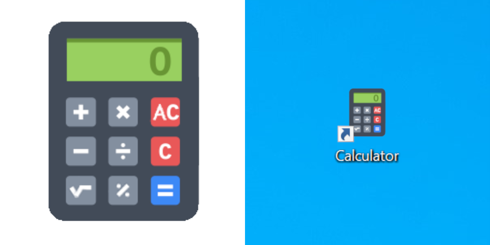

# Calculator Icon for Windows

 

This repository is for sharing my Windows parts - hopefully making them easy to find and saving time for others. Feel free to utilize and adapt them as you wish.

## Calculator Icon Windows, Computer Icons, Free, ICO, PNG

## Download:
Files included:
* calculator_icon_windows_v1.0.ico
* calculator_icon_general_use_v1.0.png
 
[Download .zip](https://github.com/boxbot6/calculator-icon-windows-v1.0/raw/main/downloads/calculator-icon-windows-v1.0.zip)

Sizes: 256x256 pixels, 32 Bit depth

To install:
- Download and unzip the files, move the icons to a new folder or stable location (remember not to rename, move or delete this folder/location in the future or all your changed icons may suddenly disappear if the system can't find the path to them!)
- In Windows, right-click the shortcut you want to change the icon for and select 'Properties'.
- On the Shortcut tab (or Web Document tab if it's a webpage shortcut) click the 'Change Icon' button, browse to the directory where you placed the downloaded .ico files, select the one you want and then click OK and then OK again...done.

 

Similar to one from freeiconshop.com, thanks to them.
